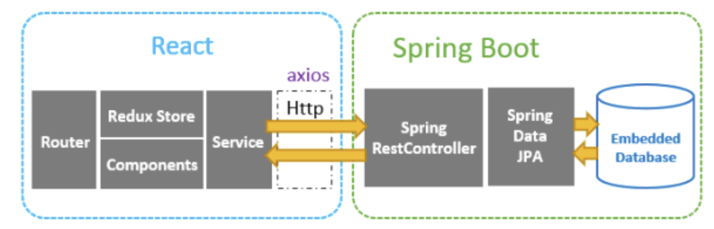
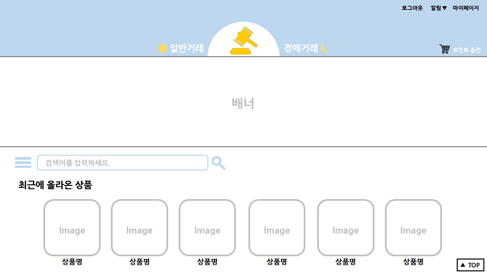
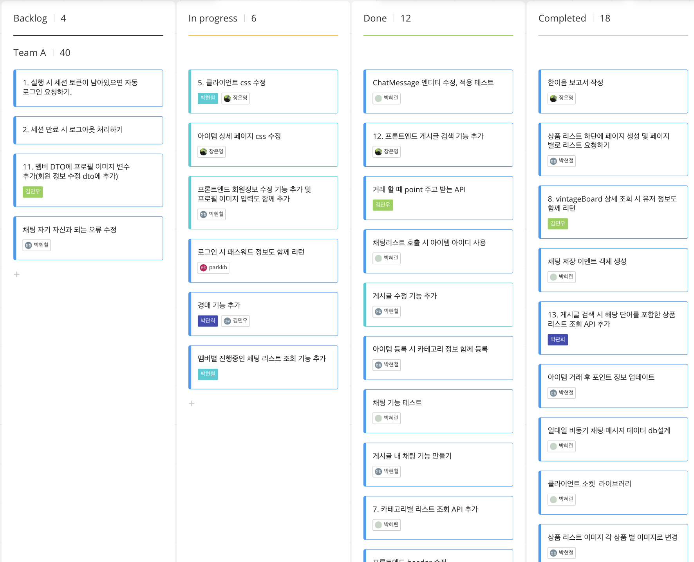

### 프로젝트 구성

---

### 진행 방식

---

### 기능 정의

---

- 판매자와 구매자 간 채팅
- 중고 상품 등록

### 구현 방식

---

- 소켓을 이용한 채팅 기능 구현
- 채팅방 생성 및 채팅 기록 저장
- 상품 ERD 설계, DB 구현
- JPA를 이용한 상품 등록 및 관리 기능 구현

## 회고

---

### 프로젝트 시작
한이음 ICT 멘토링을 통해 중고거래경매플랫폼 프로젝트를 진행했습니다. 10개월간 5명의 팀원이 함께했으며, 저는 백엔드 개발과 배포를 담당했습니다. 중고물품을 거래 혹은 경매할 수 있는 웹 서비스를 구축하고 클라우드 상에 배포하는 것이 목표였고, 목표대로 기간 내에 서비스를 구현하고 AWS EC2 상에 컨테이너를 이용해 배포했습니다. 이 프로젝트에서 다음과 같이 서비스를 구현했고 프로젝트 협업과 멘토링 과정을 통해 리소스풀하게 성장하는 법을 배웠습니다.

### 채팅API 개발과 서비스 배포
저는 스프링부트와 JPA를 사용해 채팅 API를 개발했습니다. 우선 채팅방의 특성과 기능을 정의했습니다. 중고거래 특성상 채팅이 빈번하지 않고, 같은 사용자라도 거래 물품에 따라 채팅방이 구분되며 상품 거래 성사를 등록하는 기능이 포함되어야 했습니다. 그래서 데이터 read write가 느리더라도 데이터 중복 위험이 적고 관계된 데이터 변경에 용이한 RDB를 사용하기로 했고, 테이블을 설계했습니다. 다음으로 웹소켓을 통해 채팅기능을 구현했고, DB저장과 조회, 알림 등의 서비스 간의 의존성을 낮추고자 메시지 브로커를 활용했습니다. 마지막으로, 서비스를 클라우드 상에 도커와 쿠버네티스를 활용해 배포했습니다. 

### 리소스풀하게 성장하기
이 프로젝트를 통해 다양한 자원을 잘 활용하는 법을 배웠습니다. 기술을 이해하고 효과적으로 적용하기 위해 클라우드 아키텍트이신 멘토님의 강의, 공식문서와 오픈소스를 활용했습니다. 가령 프로젝트에 쿠버네티스를 적용할 때, 컨테이너 기술과 쿠버네티스의 관계를 이해하고, 공식문서와 오픈소스를 참고해 3개의 OS에서 어플리케이션을 정상 실행시켰습니다. 또한 멘토님의 실무 사례와 협업툴을 통해 스프린트 과정에서 나타난 리드타임이 늘어지는 문제, 태스크 우선순위 선정 문제 등을 해결했습니다. 이런 과정을 통해 산재된 정보를 활용해 빠르고 유연하게 기술을 익힐 수 있었고, 열린 자세로 공부하며 성장하는 습관을 다졌습니다.

